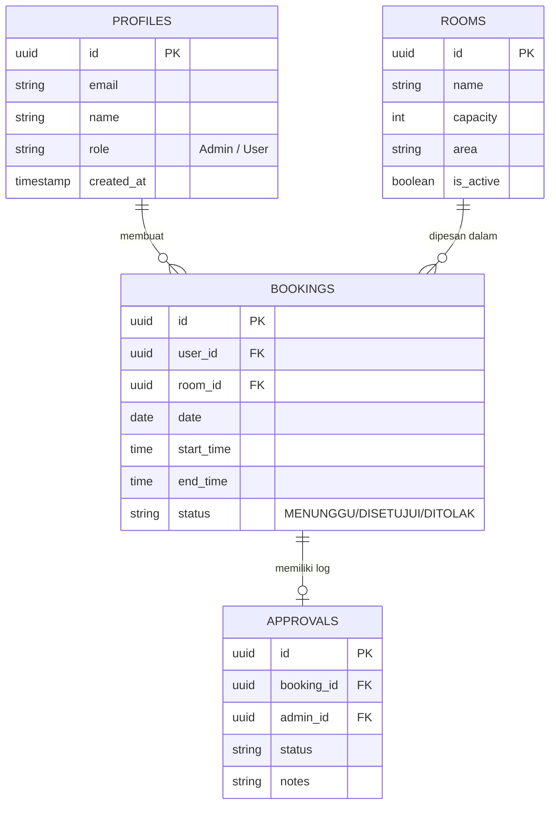
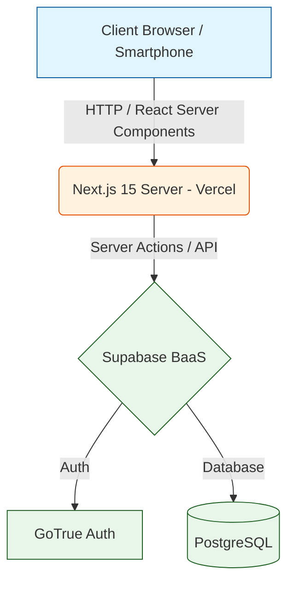

# Materi Presentasi UAS - KampusConnect
Berikut adalah draft lengkap konten presentasi Anda yang disusun berdasarkan ketentuan dari file *Soal UAS*. Anda tinggal menyalin (copy-paste) teks dan diagram di bawah ini ke dalam PowerPoint (PPT) Anda.

---

## Slide 1: Judul & Anggota
**Judul Sistem:** KampusConnect - Sistem Informasi Manajemen Fasilitas & Reservasi Ruangan Kampus
**Kelompok:** [Isi Nama Kelompok Anda]
**Anggota:**
1. [Nama Anda] - [NIM]
2. [Nama Teman] - [NIM]
3. [Nama Teman] - [NIM]

**Link YouTube Demo:** [Masukkan Link Video Anda Nanti]

---

## Slide 2: Latar Belakang, Rumusan Masalah & Solusi
**Latar Belakang Proyek:**
Proses peminjaman ruangan untuk kegiatan organisasi kemahasiswaan seringkali masih dilakukan secara manual atau terdesentralisasi. Hal ini menyebabkan lambatnya proses birokrasi, tingginya potensi bentrok jadwal, dan kurangnya transparansi ketersediaan ruangan.

**Rumusan Masalah:**
Bagaimana membangun sebuah sistem informasi terpadu yang dapat memudahkan mahasiswa dalam mencari jadwal kosong, mengajukan peminjaman, serta mempermudah pihak admin/kampus dalam mengelola dan menyetujui jadwal ruangan secara *real-time*?

**Solusi:**
Mengembangkan **KampusConnect**, sebuah aplikasi berbasis *Web App* mutakhir yang memungkinkan pengguna untuk memantau kapasitas ruangan, melihat kalender pemakaian, serta melakukan pengajuan reservasi secara digital dengan manajemen persetujuan (approval) yang jelas.

---

## Slide 3: Ruang Lingkup & Kebutuhan
**Fungsionalitas Utama (Functional Requirements):**
1. Sistem Autentikasi (Login/Logout) dengan 2 level hak akses (Admin & User).
2. Katalog Ruangan: Fitur melihat ruangan, filter kapasitas, area, dan ketersediaan.
3. Transaksi Reservasi (Create & Read): User dapat mengajukan jadwal dan melihat riwayat (Reservasi Saya).
4. Persetujuan & Manajemen (Update & Delete): Admin dapat menyetujui/menolak pengajuan dan mengelola ruangan.
5. Dashboard & Laporan: Rekapitulasi statistik total ruangan, pengguna, dan grafik persetujuan.

**Non-Fungsionalitas (Non-Functional Requirements):**
1. **Responsibilitas:** UI/UX yang adaptif, mulus digunakan di *Desktop* maupun *Smartphone* (Mobile-friendly).
2. **Performa:** Loading yang sangat cepat menggunakan teknologi *Server-Side Rendering* (SSR).
3. **Keamanan:** Database terlindungi menggunakan *Row Level Security* (RLS).

---

## Slide 4: Pemodelan & Arsitektur Data

*(Anda bisa mengubah kode Mermaid di bawah ini menjadi gambar diagram menggunakan website seperti https://mermaid.live)*

### 1. Use Case Diagram
```mermaid
usecaseDiagram
    actor "Mahasiswa / User" as User
    actor "Administrator" as Admin

    package "KampusConnect" {
        usecase "Melihat Katalog Ruangan" as UC1
        usecase "Mengajukan Reservasi" as UC2
        usecase "Melihat Riwayat Reservasi" as UC3
        usecase "Login / Logout" as UC4
        
        usecase "Melihat Dashboard Analitik" as UC5
        usecase "Menyetujui / Menolak Reservasi" as UC6
        usecase "Mengelola Data Ruangan (CRUD)" as UC7
        usecase "Mengelola Data Pengguna (CRUD)" as UC8
    }

    User --> UC1
    User --> UC2
    User --> UC3
    User --> UC4

    Admin --> UC4
    Admin --> UC5
    Admin --> UC6
    Admin --> UC7
    Admin --> UC8
```

### 2. Entity Relationship Diagram (ERD)
*(Memenuhi kriteria minimal 3 entitas yang terhubung sempurna)*


### 3. Arsitektur Teknologi (Tech Stack Architecture)


---

## Slide 5: Manajemen Hak Akses
Sistem kami menggunakan otorisasi berbasis *Role-Based Access Control* (RBAC), dengan pembagian:

**1. Administrator (Pengelola Kampus)**
* Peran: Sebagai *super-user* yang menjaga keteraturan sistem.
* Hak Akses: 
  * Akses penuh ke *Dashboard Admin* untuk melihat laporan statistik.
  * Bisa melakukan persetujuan (Approve/Reject) pada antrean jadwal (*Booking Management*).
  * Bisa menambah, mengedit, atau menonaktifkan ruangan (*Room Management*).

**2. User Biasa (Mahasiswa / Perwakilan Organisasi)**
* Peran: Sebagai pemohon fasilitas.
* Hak Akses:
  * Akses ke halaman Katalog Ruangan.
  * Fitur memfilter dan mencari ruangan berdasarkan kapasitas.
  * Membuat pengajuan (*Create Booking*).
  * Hanya dapat melihat dan membatalkan jadwal yang ia buat sendiri (*Data Isolation*).

---

## Slide 6: Sesi Demo Program
*(Slide ini cukup berisi screenshot halaman depan aplikasi Anda atau tulisan "Sesi Live Demo", lalu Anda mempresentasikan langsung aplikasinya. Panduan alur demo:)*
1. Tunjukkan tampilan *Mobile-responsive* di layar.
2. Login sebagai **User**, lalu peragakan cara melihat ruang dan *booking* ruangan.
3. Logout, lalu Login sebagai **Admin**.
4. Buka *Dashboard Admin*, tunjukkan grafik dan data statistik yang berubah (*Read*).
5. Lakukan persetujuan (*Update*) pada *booking* yang tadi dibuat.
6. Perlihatkan halaman *Kelola Ruang* untuk fungsi *Create* dan *Delete*.

---

## Slide 7: Hasil Testing
Sistem telah diuji dan menghasilkan metrik sebagai berikut:
1. **Fungsionalitas:** Skema CRUD (Create, Read, Update, Delete) berjalan 100% tanpa *error* pada modul Ruangan, User, dan Reservasi. Validasi data mencegah input jadwal ganda.
2. **Kemudahan Pengguna:** Transisi antar halaman sangat mulus berkat implementasi antarmuka yang reaktif. Tombol dan navigasi khusus HP berfungsi dengan sangat baik (seperti *bottom bar*).
3. **Kecepatan & Performa:** Terintegrasi dengan fitur optimasi gambar dan *Vercel Speed Insights*. Skor performa sangat tinggi, bebas *lag*.
4. **Keamanan Data:** Setiap transaksi divalidasi ganda di sisi *Backend (Server Actions)*. Penggunaan token tersinkronisasi dengan Supabase, memastikan satu *User* tidak bisa membobol jadwal *User* lainnya.

---

## Slide 8: Penutup
**Kesimpulan:**
KampusConnect berhasil mengimplementasikan seluruh kebutuhan sistem informasi skala modern yang efisien, responsif, dan aman. Sistem ini siap memfasilitasi birokrasi penyewaan fasilitas kampus dengan standar industri terkini.

*Terima kasih.*
*(Sesi Tanya Jawab)*
