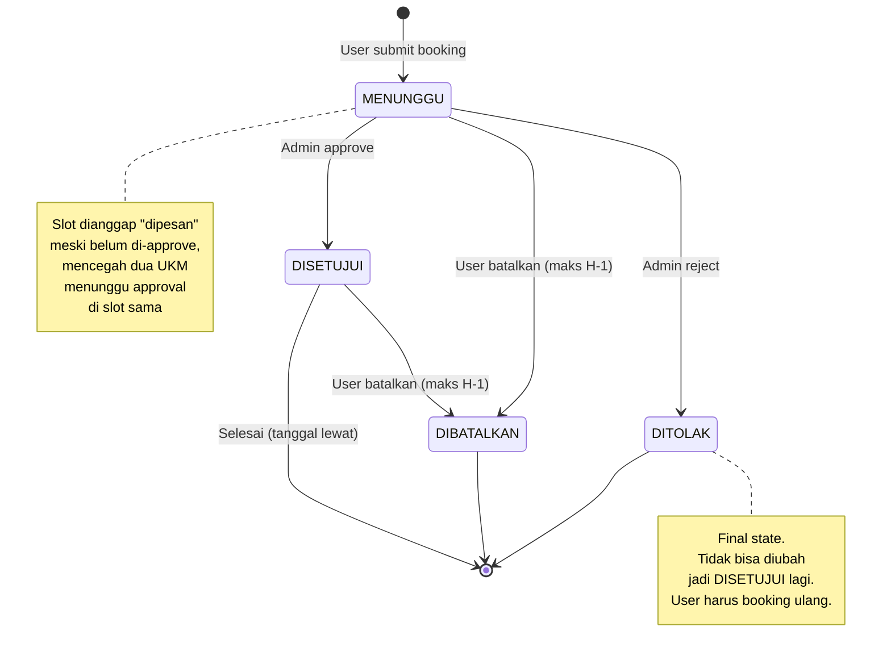
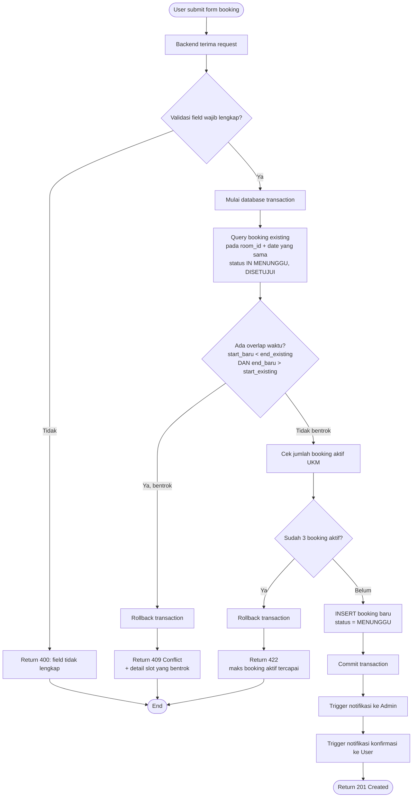
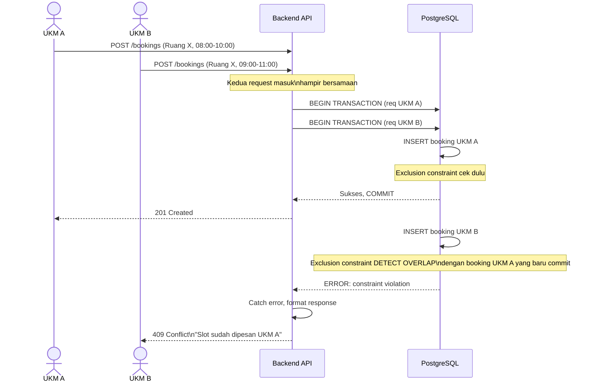
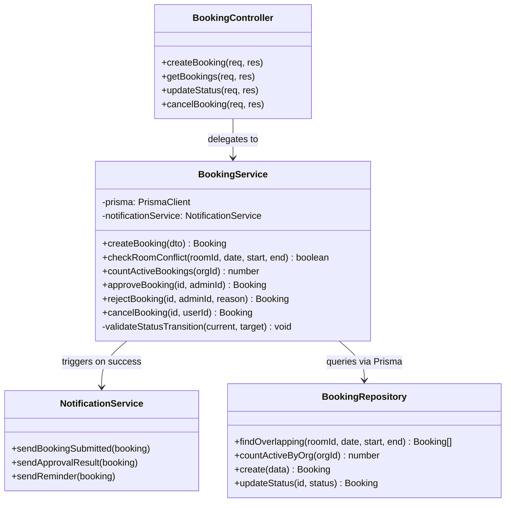
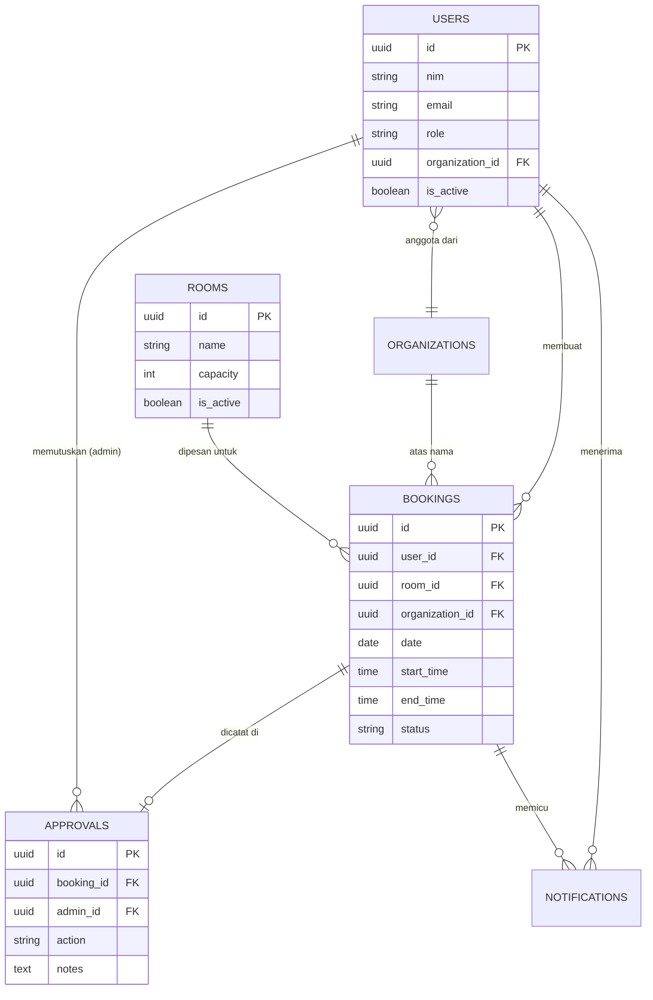

# uml.md — Diagram Pendukung Sidang KampusConnect

Diagram di sini fokus pada dua hal yang paling sering digali penguji: **state machine status
booking** dan **algoritma deteksi bentrok**. Untuk diagram lengkap (Use Case, Sequence, ERD,
Class) lihat `UML_KampusConnect.html`.

Format menggunakan Mermaid — bisa langsung di-render di GitHub, GitLab, Notion, atau VS Code
dengan extension Mermaid.

---

## 1. State Machine — Status Booking

---

## 2. Activity Diagram — Algoritma Cek Bentrok (Detail)

**Catatan penting untuk dijelaskan:** Validasi overlap dan insert booking terjadi dalam **satu
database transaction** yang sama. Ini krusial — kalau dipisah jadi dua query terpisah (cek
dulu, baru insert), ada window waktu di antaranya yang rentan race condition. Dengan
transaction + exclusion constraint di level database, window itu tertutup.

---

## 3. Sequence Diagram — Skenario Race Condition (2 User Bersamaan)

---

## 4. Class Diagram Ringkas — Service Layer (Tempat Logic Bentrok)

**Catatan arsitektur:** `checkRoomConflict()` dan `validateStatusTransition()` sengaja
ditaruh di `BookingService`, bukan di controller atau langsung di route handler. Alasannya:
business logic harus testable secara terisolasi (unit test tanpa perlu spin up HTTP server),
dan controller harus tetap "tipis" — cuma menerjemahkan HTTP request/response.

---

## 5. ERD Fokus — Relasi yang Sering Ditanya

**Kenapa `organization_id` ada di dua tempat (USERS dan BOOKINGS)?**
Pertanyaan yang sering muncul. Jawaban: `users.organization_id` menunjukkan UKM mana user itu
anggotanya (data keanggotaan). `bookings.organization_id` dicatat terpisah karena kalau user
pindah/keluar dari UKM di kemudian hari, histori booking tetap menunjukkan booking itu
dilakukan atas nama UKM yang benar saat itu — bukan ikut berubah mengikuti UKM user saat ini.
Ini disebut **denormalisasi yang disengaja** untuk menjaga akurasi historis.
